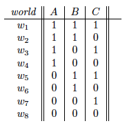
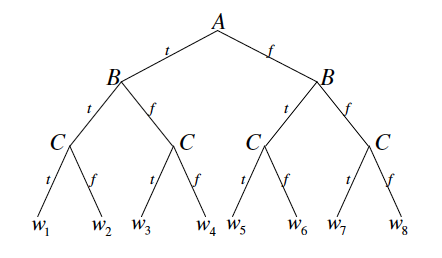
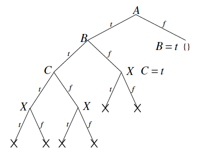
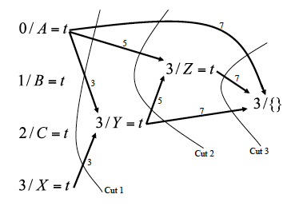

## Brute force

*Figure from Chapter 3, page 1 of draft chapter on satisfiability by
Adnan Darwiche*

The brute force approach to checking satisfiability is to go through all
possible worlds and check if the formula is satisfied. For example, a
brute force approach for testing the satisfiability of some formula with
three variables A, B, and C would visit the possible worlds
$$w_{1},w_{2},...,w_{8}$$ in some order and check if the formula is
satisfied in any of the eight worlds. To prove unsatisfiability, we
would need to try all possible worlds. In the worst case, checking
satisfiability is NP-complete because the number of possible worlds is
exponential in the number of variables, and any kind of reasoning
algorithm would take exponential time. Nonetheless, in practice, one can
usually solve many kinds of real-world problems tractably using the
techniques discussed below.

## Early stopping

One improvement over brute force search is to do early stopping. We can
visualize the search process as traversing a binary tree where each node
corresponds to a variable and the left branch corresponds to setting
that variable to true and the right branch corresponds to setting that
variable to false. After making assignments to a couple of variables, we
might be able to declare early success if we find a satisfying
assignment. In addition, whenever we encounter a formula that is already
unsatisfiable, we backtrack and avoid the need to search the subtree
rooted at that node.

Note that this algorithm requires us to choose a variable ordering. Each
time we go down a branch and make a variable assignment, we can simplify
the CNF. At every step, we check if there exists an empty clause which
means that the formula cannot be satisfied. If we eliminate all of the
clauses, then the formula is satisfiable.

*Figure from Chapter 3, page 2 of draft chapter on satisfiability by
Adnan Darwiche*

Going back to our earlier example with three variables A, B, and C, we
traverse the tree starting from the root and check if the formula is
satisfied or unsatisfiable each time we make an assignment to a
variable. For the hypothetical formula
$${\left(\neg A\right)}\land{\left(B\lor C\right)}$$, upon setting $$A$$ to
true, we know that the formula becomes unsatisfiable, so we can
immediately backtrack and set $$A$$ to false. Then when we set $$B$$ to
true, we can immediately conclude that the formula is satisfiable.

## Unit resolution

Whenever there is a clause with only one literal, then the only way to
satisfy the formula is to set the corresponding variable so that clause
is true. For example, if $${\Delta}$$ consists of
$$\{B\},\{\neg B\lor\neg C\},\{C\lor\neg D\}$$, then we must set B to
true, then set C to false, and finally D to false.

Another improvement is if a variable only appears in the formula in its
negated or unnegated form, then we know how to set the value of that
variable.

## DPLL algorithm

The DPLL algorithm combines DFS with early stopping, unit propagation
and pure literals. With these heuristics, DPLL is a very effective
backtracking SAT solver. The recursive algorithm for DPLL is as follows.

$$DPLL(\phi,{\alpha})$$:
1.  If $$\phi\vert{\alpha}$$ is empty, return satisfiable.
2.  If $$\phi\vert{\alpha}$$ contains an empty clause,
    return unsatisfiable.
3.  If $$\phi\vert{\alpha}$$ contains a unit clause $$\{p\}$$, return
    $$DPLL(\phi,{\alpha}p)$$.
4.  If $$\phi\vert{\alpha}$$ has a pure literal $$p$$, return
    $$DPLL(\phi,{\alpha}p)$$.
5.  Let $$p$$ be a literal from a minimum size clause of
    $$\phi\vert{\alpha}$$. If $$DPLL(\phi,{\alpha}p)$$ returns satisfiable,
    return satisfiable. Else, return $$DPLL(\phi,{\alpha}\neg p)$$.

## Clause Learning

Fundamentally, the biggest limitation from a backtracking solver like
DPLL is that you don’t learn from your mistakes so you might make the
same mistakes over and over. For example, suppose that the variable
ordering we choose for DPLL is unlucky in that the decision we make for
the first variable leads the rest of the clauses to be inconsistent but
unit propagation cannot detect this so we end up visiting each
assignment to the variables that is not a satisfying assignment.

Clause learning adds clauses that are implied by the knowledge base,
which are discovered during the search process, to the knowledge base.
Adding clauses that are implied by the knowledge base, particularly
short clauses, can empower unit propagation and allow a different way of
searching the tree that is non-chronological.

We will use a graph-based data structure, called an implication graph,
that has nodes corresponding to variable assignments (either decisions
we make when branching or implications via unit propagation). The
directed edges in the graph will record dependencies among the variable
assignments. Each node in the implication graph has the form $$l/V=v$$
which means that at level $$l$$, variable $$V$$ has been set to value $$v$$.
Whenever we branch on a variable, we create a node for this variable
assignment but do not add any edges. Whenever unit propagation allows us
to derive the value of a variable, we create a node for this variable
assignment, and we add directed edges to this new node from the nodes
corresponding to the variable settings that allowed unit propagation to
make this derivation and label each edge with the clause that was used
to make the derivation.

When we reach a contradiction, we can build a conflict graph and
identify opportunities to learn from mistakes. In an implication graph
which terminates in a contradiction, every cut that separates the
decision variables from the contradiction defines a conflict set. The
nodes in the conflict set are exactly the source nodes of all of the
(directed) edges that cross the cut.

Though there may be several conflict sets, a typical approach is to
identify a cut so that there is only one decision variable at the
highest (last) decision level on the reason side and then backtrack to
the second highest (second to last) decision level. Following this
backtracking procedure, the clause that was added is guaranteed to
trigger unit propagation.

Another approach is to identify a Unique Implication Point (UIP) which
is a node at the highest decision level that appears in every path from
the highest decision level to the contradiction. If there is more than
one UIP, often we choose a UIP that is closest to the contradiction
since this might allow shorter clauses.

Non-chronological backtracking is sound and complete assuming we keep
all of the clauses that we learned. Note that non-chronological
backtracking might go down the same path multiple times.

## Example for DPLL and Clause Learning

Consider the formula $${\Delta}$$ below:
1.  \$$\{A,B\}$$
2.  \$$\{B,C\}$$
3.  \$$\{\neg A,\neg X,Y\}$$
4.  \$$\{\neg A,X,Z\}$$
5.  \$$\{\neg A,\neg Y,Z\}$$
6.  \$$\{\neg A,X,\neg Z\}$$
7.  \$$\{\neg A,\neg Y,\neg Z\}$$

*Figure from Chapter 3, page 8 of draft chapter on satisfiability by
Adnan Darwiche*

For DPLL, assume the variable ordering $$A,B,C,X,Y,Z$$ for the search
procedure and variables are assigned true before being assigned false
when branching. The result of running DPLL on this formula is given by
the figure above. We see that the DPLL algorithm is forced to explore
almost half of the entire tree before detecting the contradiction.

*Figure from Chapter 3, page 11 of draft chapter on satisfiability by
Adnan Darwiche*

On the other hand, when running CDCL on the same formula with the same
search tree, CDCL will learn a good clause to add to the KB from a cut
in the implication graph. These learned clauses allow CDCL to traverse
the search tree in a more efficient manner.

## Engineering considerations

Key features of SAT solvers:
1.  Conflict-driven clause learning
2.  Unit propagation with watched literals
3.  Dynamic variable selection/branching heuristic
4.  Random restarts

An efficient implementation of unit propagation is very important since
a lot of time is spent doing unit propagation. We can implement unit
propagation more efficiently by using a lazy approach. We only watch two
variables in each clause. Every time we assign a variable, we only need
to check the clauses for which that variable is watched. Whenever a
watched variable becomes assigned to true or false, we check each clause
for which that variable is watched: if we can we do unit propagation, we
do unit propagation and that clause becomes satisfied; otherwise, we
find another variable in that clause to watch.

In what order do we assign the variables and values? We try to keep
track of how important each variable is. One heuristic is that if a
variable appears in many clauses, it’s probably more important.

Restarts with different random seeds (while keeping learned clauses) can
be very helpful in practice because the runtime distribution of
backtrack search methods exhibits a heavy tail. The size of the search
tree can vary dramatically, depending on the order in which we pick the
variables, so a SAT solver can get lost in a large part of the state
space where there is no solution. If you keep doing restarts, how can
you guarantee completeness? One heuristic is to double the restart
cutoff each time.

# Special cases of SAT problems

We now discuss two special cases of satisfiability problems that can be
solved in polynomial time, Horn SAT and 2-SAT. These problems define
subclasses of general CNF formulas which satisfy some specific
structure. By restricting the expressive power of the language, these
subclasses of problems become easier to solve. The algorithms for
solving these problems are essentially based on unit propagation.

## Horn SAT

We begin with the relevant definitions for a Horn formula:
-   A literal is a positive literal if it is some variable. A literal is
    a negative literal if it is the negation of some variable.
-   A clause is positive if all of the literals are positive. A clause
    is negative if all of the literals are negative.
-   A clause is horn if it has at most one literal that is positive. For
    example, the implication $$(p\land q)\Rightarrow z$$ is equivalent to
    $$\neg p\lor\neg q\lor z$$ which is horn.
-   A formula is horn if all of the clauses are horn.

**Lemma**: Let $$S$$ be a set of unsatisfiable clauses. Then $$S$$ contains
at least one positive clause and one negative clause.

***Proof***: Suppose that the formula contains no positive clause. Then
every clause contains at least one negative literal. We can satisfy the
formula with a truth assignment that assigns false to all of the
variables.

**Theorem**: Let $$S$$ be a set of Horn clauses. Let $$S'$$ be the set of
clauses obtained by running unit propagation on $$S$$. Then $$S'$$ is
satisfiable if and only if the empty clause does not belong to $$S'$$.

***Proof*** ($$\Rightarrow$$): If the empty clause belongs to $$S'$$, then
$$S'$$ cannot be satisfiable because unit propagation is sound.

***Proof*** ($$\Leftarrow$$): If $$S$$ is horn, then $$S'$$ is also horn.
Assume $$S'$$ is unsatisfiable. By Lemma 1, $$S'$$ contains at least 1
positive clause and 1 negative clause. A clause that is both positive
and horn must either be a unit clause or an empty clause. We cannot
derive a unit clause since we’ve run unit propagation until a fixed
point, so there must exist an empty clause.

## 2-SAT

A formula is in k-CNF if it is in CNF and each clause has at most k
literals. The following algorithm can be used to determine the
satisfiability of a 2-CNF formula in polynomial time.
1.  \$${\Gamma}\leftarrow KB$$
2.  while $${\Gamma}$$ is not empty do:
    1.  \$$L\leftarrow\text{pick a literal from }{\Gamma}$$
    2.  \$${\Delta}\leftarrow\text{UP}({\Gamma},L)$$
    3.  if $$\{\}\in{\Delta}$$ then
        1.  \$${\Delta}\leftarrow\text{UP}({\Gamma},\neg L)$$
        2.  if $$\{\}\in{\Delta}$$ then return unsatisfiable
    4.  \$${\Gamma}\leftarrow{\Delta}$$
3.  Return satisfiable

**Lemma**: If $${\Gamma}$$ is a 2-CNF formula in which the literal $$L$$
occurs, then either:
1.  UP$$(\Gamma,L)$$ contains the empty clause $$\{\}$$, so
    $${\Gamma}\models\neg L$$.
2.  UP$$(\Gamma,L)$$ is a proper subset of $${\Gamma}$$.

***Proof***: For each clause, we consider one of the three cases.
1.  If the clause contains $$L$$, then the clause is satisfied.
2.  If the clause contains $$\neg L$$, then this clause becomes a unit
    clause and unit propagation is triggered.
3.  Otherwise, the clause remains unchanged.

***Proof of correctness*** ($$\Rightarrow$$): If the algorithm returns
satisfiable, the formula is satisfiable since the algorithm relies on
unit propagation and branching.

***Proof of correctness*** ($$\Leftarrow$$): Consider the formula
$${\Gamma}$$ at the beginning of the iteration in which we return
unsatisfiable. Since $${\Gamma}$$ is a 2-CNF formula,
$${\Gamma}\subseteq KB$$ (meaning the set of clauses in $${\Gamma}$$ is
always a subset of the clauses in $$KB$$ ), so if $${\Gamma}$$ is
unsatisfiable, then $$KB$$ is unsatisfiable. We know that both
$${\Gamma}\land L$$ and $${\Gamma}\land\neg L$$ are unsatisfiable. This
implies that $${\Gamma}$$ is unsatisfiable, so $$KB$$ is unsatisfiable.
